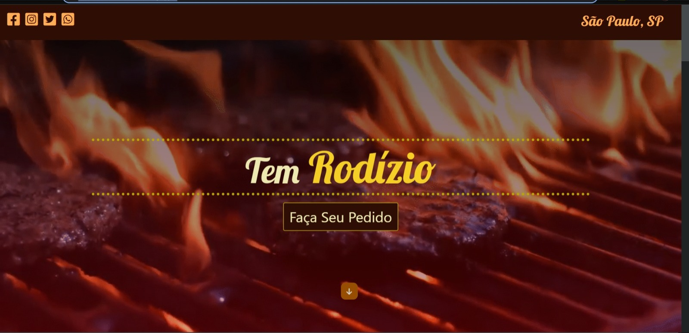
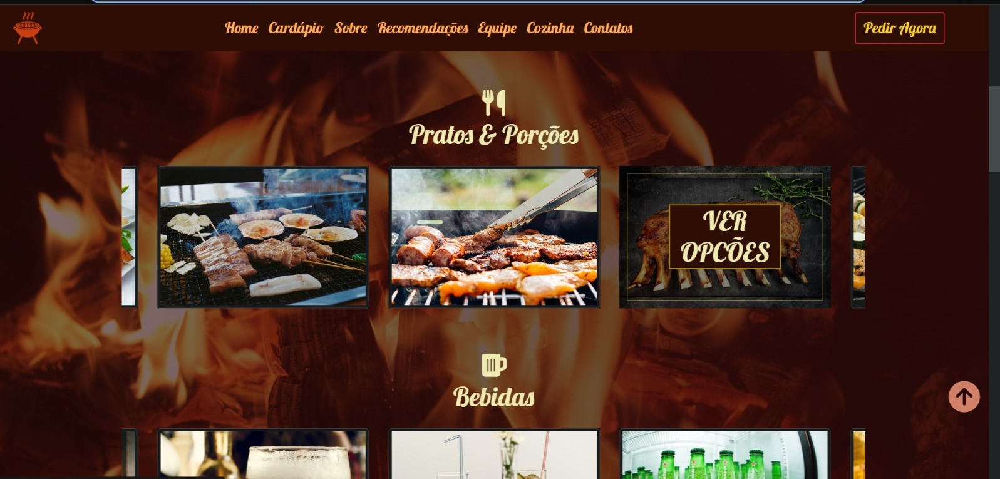
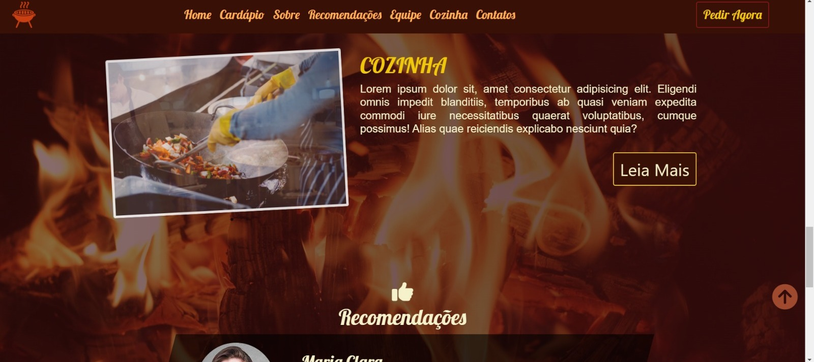
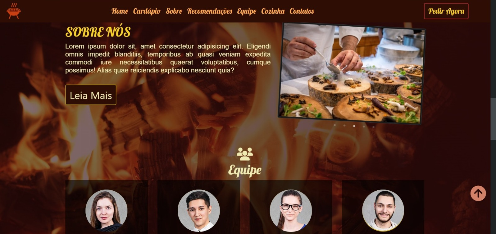
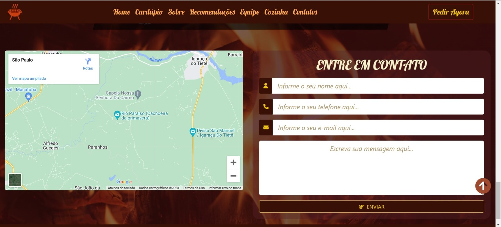

<h1>Na Brasa Churrascaria</h1>

_O projeto Na Brasa Churrascaria é um site moderno criado do zero, utilizando ferramentas atuais e tecnologias de ponta para criar uma interface moderna e profissional. O site é responsivo e se ajusta a qualquer tamanho de tela, proporcionando uma experiência agradável para o usuário._

<h1>

<h2>Imagens do projeto</h2>
 

Page Principal

Porções
  

Cozinha
  

Sobre
  

Card Funcionários
  

Contatos
  

<h1> 
<h2>Tecnologias Utilizadas</h2>
 

**As principais tecnologias utilizadas no projeto foram:**
 

- SASS: Um pré-processador CSS que permite escrever CSS de maneira mais organizada e com mais recursos.
  Flexbox: Um layout flexível que permite organizar os elementos em uma página de maneira mais fácil e responsiva.

- CSS3 Grid Layout: Um sistema de layout bidimensional que permite organizar os elementos em uma página de maneira mais precisa e eficiente.

- Bootstrap: Um framework CSS que permite criar interfaces mais rapidamente, com uma base sólida e muitos componentes já prontos.

- Javascript: A principal linguagem de programação para web, que permite criar interatividade e dinamismo na página.

- Carousel: Um plugin Javascript que permite criar um carrossel de imagens para melhorar a usabilidade do usuário.

- Unidades de medidas responsivas: Unidades de medidas como em, rem e vw que se adaptam ao tamanho da tela do usuário.

- Media Queries: Uma técnica para definir estilos diferentes para diferentes tamanhos de tela.
  Adobe XD: Um software de design para criar wireframes, protótipos e layouts de interfaces.

- Zeplin: Uma ferramenta de colaboração entre designers e desenvolvedores, que permite extrair informações e recursos do layout criado no Adobe XD.
 
 
<h1>
<h2>Funcionalidades</h2>
 
O site da Na Brasa Churrascaria conta com diversas funcionalidades para melhorar a experiência do usuário, incluindo:

- Página inicial com informações sobre a churrascaria, menu e localização.

- Página de pedidos, onde o usuário pode fazer o pedido pelo formulário para enviar mensagem para a churrascaria.

- Página de cardápio, onde o usuário pode visualizar os pratos e bebidas disponíveis na churrascaria.

- Formulario para entrar em contato, inserindo informações como nome, telefone, e email, e podendo deixar sua mensagem.
